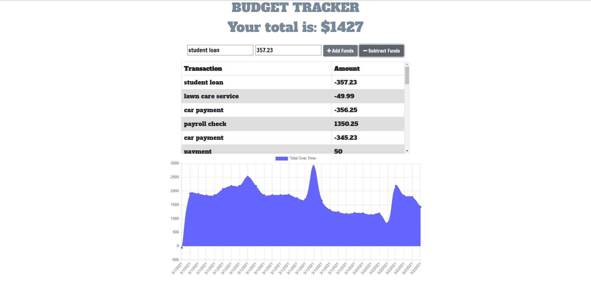

# Budget-Tracker
For this project, I will add functionality to our existing Budget Tracker application to allow for offline access and functionality.  The user will be able to add expenses and deposits to their budget with or without a connection. When entering transactions offline, they should populate the total when brought back online. 

## Tech Required: 
* NodeJS
    * Dependencies: 
      * dotenv
      * express
      * mongoose
      * morgan
* Mongoose
* MongoDB
* IndexedDB
* Chrome Dev Tools
* Heroku
* Service Worker
* Manifest 

## Screenshots:

## View my work: 
* https://blooming-dusk-07237.herokuapp.com/
* https://github.com/amcmilne/Budget-Tracker
   
## License:
* MIT
  